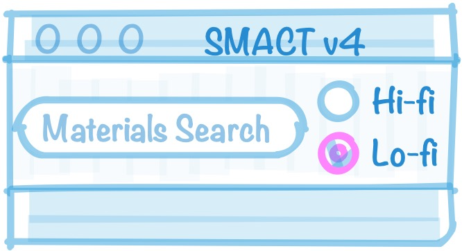
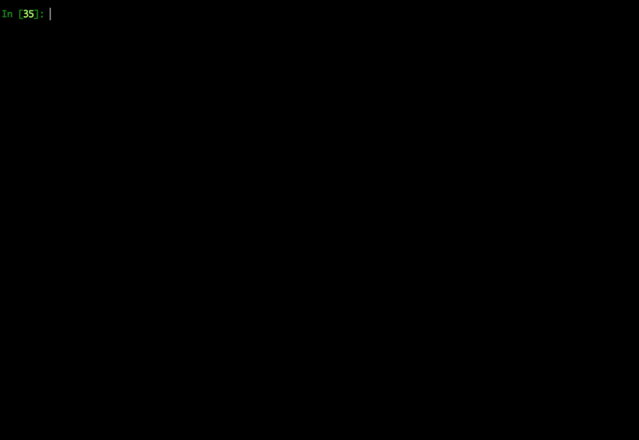

SMACT
=====

**Semiconducting Materials from Analogy and Chemical Theory** (SMACT) is a collection of rapid screening tools that uses data about chemical elements.

- **Documentation:** https://smact.readthedocs.io/en/latest/
- **Examples folder:** https://github.com/WMD-group/SMACT/tree/master/examples

*If you torture the data enough, nature will always confess* - Roland Coase (from 'How should economists choose?')

Statement of need
--------
There is a strong demand for functional materials across a wide range of technologies. The motivation can include cost reduction, performance enhancement, or to enable a new application. Data collections such as the [Materials Project](https://www.materialsproject.org), [NREL Materials Database](http://materials.nrel.gov) and the [Open Quantum Materials Database](http://oqmd.org) are valuable resources, but they largely cover the properties of *known* compounds as calculated using high-level quantum mechanical theories.

We have developed low-cost procedures for screening hypothetical materials in SMACT. This framework can be used for simple calculations on your own computer. SMACT follows a top-down approach where a set of element combinations is generated and then screened using rapid chemical filters. It can be used as part of a multi-technique workflow or to feed machine learning models for materials.

Getting started
-----

SMACT's features are accessed through Python scripts, importing classes and functions as needed.
The best place to start is looking at [the docs](https://smact.readthedocs.io/en/latest/), which highlight some simple examples of how these classes and functions can be used.
Extended examples are available in [our examples folder](https://github.com/WMD-group/SMACT/tree/master/examples).

Code features
--------
- At the core of SMACT are [Element](https://smact.readthedocs.io/en/latest/smact.html#smact.Element) and [Species](https://smact.readthedocs.io/en/latest/smact.html#smact.Species) (element in a given oxidation state) classes that have various properties associated with them. 

- The various oxidation states that are accessible to each element are included in their properties.

- Element compositions can be screened through based on the heuristic filters of charge neutrality and electronegativity order. This is handled using the [screening module](https://smact.readthedocs.io/en/latest/smact.screening.html) and [this publication](https://www.cell.com/chem/fulltext/S2451-9294(16)30155-3) describes the underlying theory. An example procedure is [outlined in the docs](https://smact.readthedocs.io/en/latest/examples.html#neutral-combinations) and further examples can be found in the [counting examples subfolder](https://github.com/WMD-group/SMACT/tree/master/examples/Counting).

- Further filters can be applied to generated lists of compositions in order to screen for particular properties. These properties are either intrinsic properties of elements or are calculated for compositions using the [properties module](https://smact.readthedocs.io/en/latest/smact.properties.html). For example: 
  - A use case is shown in [this publication](https://pubs.rsc.org/en/content/articlehtml/2018/sc/c7sc03961a), in which 160,000 chemical compositions are screened based on optical band gap calculated using the [solid-state energy scale](https://www.sciencedirect.com/science/article/pii/S0022459615300888).
  - The [oxidation_states module](https://smact.readthedocs.io/en/latest/smact.oxidation_states.html) can be used to filter out compositions containing metals in unlikely oxidation states according to [a data-driven model](https://pubs.rsc.org/en/content/articlelanding/2018/fd/c8fd00032h#!divAbstract).

- Compositions can also be filtered based on sustainability via the abundance of elements in the Earth's crust or via the [HHI scale](https://pubs.acs.org/doi/10.1021/cm400893e). 

- Compositions can easily be converted for use in Pymatgen or for representation to machine learning algorithms ([see "next steps" in this example](https://github.com/WMD-group/SMACT/blob/master/examples/Counting/Generate_compositions_lists.ipynb)).

- The code also has some tools for manipulating common crystal lattice types: 
 - Common crystal structure types can be built using the [builder module](https://smact.readthedocs.io/en/latest/smact.builder.html)
 - Lattice parameters can be quickly estimated using ionic radii of the elements for various common crystal structure types using the [lattice_parameters module](https://smact.readthedocs.io/en/latest/smact.lattice_parameters.html).
 - The [lattice module](https://smact.readthedocs.io/en/latest/smact.lattice.html) and [distorter module](https://smact.readthedocs.io/en/latest/smact.distorter.html) rely on the [Atomic Simulation Environment](https://wiki.fysik.dtu.dk/ase/) and can be used to generate unique atomic substitutions on a given crystal structure.  

List of modules
-------

* **smact** library containing:
  * **\_\_init\_\_.py** Contains the core `Element` and `Species` classes.
  *  **data_loader.py** Handles the loading of external data used to initialise the core `smact.Element` and `smact.Species` classes.
  *  **screening.py** Used for generating and applying filters to compositional search spaces.
  *  **properties.py** A collection of tools for estimating useful properties based on composition.
  * **lattice.py** Given the sites, multiplicities and possible oxidation states
    at those sites, this reads from the database and generates all possible
    stoichiometeries.
  * **builder.py** Builds some common lattice structures, given the chemical
    composition.
  * **lattice_parameters.py** Estimation of lattice parameters for various lattice types using covalent/ionic radii.
  * **distorter.py** A collection of functions for enumerating and then
    substituting on inequivalent sites of a sub-lattice.

Requirements
------------

The main language is Python 3 and has been tested using Python 3.6+.
Basic requirements are Numpy and Scipy.
The [Atomic Simulation Environment](https://wiki.fysik.dtu.dk/ase) (ASE),  [spglib](http://atztogo.github.io/spglib), and [pymatgen](www.pymatgen.org) are also required for many components.

Installation
------------
The latest stable release of SMACT can be installed via pip which will automatically setup other Python packages as required:

    pip install smact  

Alternatively, the very latest version can be installed using:

    pip install git+git://github.com/WMD-group/SMACT.git

For developer installation SMACT can be installed from a copy of the source
repository (https://github.com/wmd-group/smact); this will be preferred if using experimental code branches.

To clone the project from Github and make a local installation:

    git clone https://github.com/wmd-group/smact.git
    cd smact
    pip install --user -e .

With -e pip will create links to the source folder so that that changes
to the code will be immediately reflected on the PATH.

License and attribution
-----------------------

Python code and original data tables are licensed under the MIT License.

Development notes
-----------------

### Bugs, features and questions
Please use the [Issue Tracker](https://github.com/WMD-group/smact/issues) to report bugs or request features in the first instance. While we hope that most questions can be answered by searching [the docs](https://smact.readthedocs.io/en/latest/), we welcome new questions on the issue tracker, especially if they helps us improve the docs! For other queries about any aspect of the code, please contact Dan Davies by e-mail: D.Davies16@imperial.ac.uk. 

### Code contributions
We are always looking for ways to make SMACT better and more useful to the wider community; contributions are very welcome. Please use the ["Fork and Pull"](https://guides.github.com/activities/forking/) workflow to make contributions and stick as closely as possible to the following:

- Code style should comply with [PEP8](http://www.python.org/dev/peps/pep-0008) where possible. [Google's house style](https://google.github.io/styleguide/pyguide.html)
is also helpful, including a good model for docstrings.
- Please use comments liberally when adding nontrivial features, and take the chance to clean up other people's code while looking at it.
- Add tests wherever possible, and use the test suite to check if you broke anything.

### Tests
Testing modules should be pass/fail and wrapped into **tests/test_core.py** or another **tests/test_something.py** file added, if appropriate. 
Run the tests using `python -m pytest -v`.
(The final `-v` is optional and adds more detail to the output.)

We also use integrated testing on Github via [GitHub Actions](hhttps://github.com/features/actions).

### List of Developers
Contributors to SMACT: 
- Keith Butler
- Daniel Davies
- Jarvist Frost
- Tim Gauntlet
- Adam Jackson
- Chloe (Jiwoo) Lee (이지우)
- Alex Moriarty
- Kazuki Morita
- Anthony Onwuli
- Jonathan Skelton
- Aron Walsh

 Thanks to [JOSS](https://github.com/openjournals/joss-reviews/issues/1361) reviewers and editors: 
 - Adam Symington
 - Alex Ganose
 - Daniel Katz
 - Lorena Barba

References
----------

[D. W. Davies et al,
"SMACT: Semiconducting Materials by Analogy and Chemical Theory" *JOSS* **4**, 1361 (2019)](https://joss.theoj.org/papers/7efd2f2ad60d25bdccee3fbd3fc11448)

[D. W. Davies et al, 
"Data-driven discovery of photoactive quaternary oxides using first-principles machine learning" *Chem. Mater.* **31**, 7221 (2019)](https://pubs.acs.org/doi/abs/10.1021/acs.chemmater.9b01519)

[D. W. Davies et al,
"Materials discovery by chemical analogy: role of oxidation states in structure prediction" *Faraday Discuss.* **211**, 553 (2018)](https://pubs.rsc.org/en/Content/ArticleLanding/2018/FD/C8FD00032H)

[D. W. Davies et al,
"Computer-aided design of metal chalcohalide semiconductors: from chemical composition to crystal structure" *Chem. Sci.* **9**, 1022 (2018)](http://www.cell.com/chem/abstract/S2451-9294(16)30155-3)

[D. W. Davies et al,
"Computational screening of all stoichiometric inorganic materials" *Chem* **1**, 617 (2016)](http://www.cell.com/chem/abstract/S2451-9294(16)30155-3)

[B. R. Pamplin, "A systematic method of deriving new semiconducting
compounds by structural analogy", *J. Phys. Chem. Solids*
**25**, 675 (1964)](http://www.sciencedirect.com/science/article/pii/0022369764901763)
