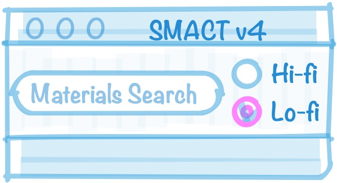

[](https://doi.org/10.21105/joss.01361)
[](https://doi.org/10.5281/zenodo.595853)
[](https://smact.readthedocs.org/en/latest/?badge=latest)
[](https://opensource.org/licenses/MIT)

[](https://github.com/astral-sh/ruff)
[](https://pypi.org/project/SMACT/)
[](https://anaconda.org/conda-forge/smact)
[](https://github.com/WMD-group/SMACT/issues)

[](https://github.com/WMD-group/SMACT/actions/workflows/ci.yml)
[](https://codecov.io/gh/WMD-group/SMACT)
 [](https://deepwiki.com/WMD-group/SMACT)

# SMACT

**Semiconducting Materials by Analogy and Chemical Theory** (SMACT) is a collection of rapid screening and informatics tools that uses data about chemical elements.

- **Documentation:** <https://smact.readthedocs.io/en/latest/>
- **Examples:** <https://smact.readthedocs.io/en/latest/examples.html>



_If you torture the data enough, nature will always confess_ - Roland Coase (from 'How should economists choose?')

## Statement of need

There is a strong demand for functional materials across a wide range of technologies. The motivation can include cost reduction, performance enhancement, or to enable a new application. We have developed low-cost procedures for screening hypothetical materials. This framework can be used for simple calculations on your own computer. SMACT follows a top-down approach where a set of element combinations is generated and then screened using rapid chemical filters. It can be used as part of a multi-technique workflow or to feed artificial intelligence models for materials.


## Getting started

Features are accessed through Python scripts, importing classes and functions as needed.
The best place to start is looking at [the docs](https://smact.readthedocs.io/en/latest/), which highlight some simple examples of how these classes and functions can be used.
Use cases are available in our [examples](https://smact.readthedocs.io/en/latest/examples.html) and [tutorials](https://smact.readthedocs.io/en/latest/tutorials.html) folders.

## Code features

- At the core of SMACT are [Element](https://smact.readthedocs.io/en/latest/smact.html#smact.Element) and [Species](https://smact.readthedocs.io/en/latest/smact.html#smact.Species) (element in a given oxidation state) classes that have various properties associated with them.

- Oxidation states that are accessible to each element are included in their properties.

- Element compositions can be screened through based on the heuristic filters of charge neutrality and electronegativity order. This is handled using the [screening module](https://smact.readthedocs.io/en/latest/smact.screening.html) and [this publication](<https://www.cell.com/chem/fulltext/S2451-9294(16)30155-3>) describes the underlying theory. An example procedure is [outlined in the docs](https://smact.readthedocs.io/en/latest/examples/filter.html).

- Further filters can be applied to generated lists of compositions in order to screen for particular properties. These properties are either intrinsic properties of elements or are calculated for compositions using the [properties module](https://smact.readthedocs.io/en/latest/smact.properties.html). For example:
  - An application is shown in [this publication](https://pubs.rsc.org/en/content/articlehtml/2018/sc/c7sc03961a), in which 160,000 chemical compositions are screened based on optical band gap calculated using the [solid-state energy scale](https://www.sciencedirect.com/science/article/pii/S0022459615300888).
  - The [oxidation_states module](https://smact.readthedocs.io/en/latest/smact.oxidation_states.html) can be used to filter out compositions containing metals in unlikely oxidation states according to [a data-driven model](https://pubs.rsc.org/en/content/articlelanding/2018/fd/c8fd00032h#!divAbstract).

- Compositions can also be filtered based on sustainability via the abundance of elements in the Earth's crust or via the [HHI scale](https://pubs.acs.org/doi/10.1021/cm400893e).

- Compositions can be converted for use in Pymatgen or for representation to machine learning algorithms ([see this example](https://smact.readthedocs.io/en/latest/tutorials/smact_generation_of_solar_oxides.html)) and the related [ElementEmbeddings](https://github.com/WMD-group/ElementEmbeddings) package.

- Charge neutrality screening supports **mixed-valence compounds** via the `mixed_valence=True` flag in `smact_validity`, enabling correct handling of materials like Fe₃O₄ and Mn₃O₄.

- Oxidation state data is sourced from **ICSD 2024**, providing an updated and stricter set of experimentally observed oxidation states per element.

- The [property prediction module](https://smact.readthedocs.io/en/latest/smact.property_prediction.html) enables composition-to-property prediction using pretrained deep learning models, including a ROOST-based band gap predictor trained on the Materials Project database.

- The code also has tools for manipulating common crystal lattice types:
  - Certain structure types can be built using the [builder module](https://smact.readthedocs.io/en/latest/smact.builder.html)
  - Lattice parameters can be estimated using ionic radii of the elements for various common crystal structure types using the [lattice_parameters module](https://smact.readthedocs.io/en/latest/smact.lattice_parameters.html).
  - The [lattice module](https://smact.readthedocs.io/en/latest/smact.lattice.html) and [distorter module](https://smact.readthedocs.io/en/latest/smact.distorter.html) rely on the [Atomic Simulation Environment](https://wiki.fysik.dtu.dk/ase/) and can be used to generate unique atomic substitutions on a given crystal structure.
  - The [structure prediction](https://smact.readthedocs.io/en/latest/smact.structure_prediction.html) module can be used to predict the structure of hypothetical compositions using species similarity measures.
  - The [dopant prediction](https://smact.readthedocs.io/en/latest/smact.dopant_prediction.html) module can be used to facilitate high-throughput predictions of p-type and n-type dopants of multicomponent solids.

## Package structure

**Legend:** 🟢 new in v4 — 🟡 improved in v4


```mermaid
graph TD
    classDef new fill:#c8e6c9,stroke:#388e3c,color:#000
    classDef improved fill:#fff9c4,stroke:#f9a825,color:#000

    SMACT(["smact"])

    SMACT --> core["Core modules"]
    SMACT --> SP["structure_prediction"]
    SMACT --> DP["dopant_prediction"]
    SMACT --> PP["🟢 property_prediction"]
    SMACT --> IO["🟢 io"]
    SMACT --> UT["utils"]

    core --> init["init.py — Element, Species, neutral_ratios"]
    core --> dl["data_loader.py — elemental and oxidation state data loading"]
    core --> sc["🟡 screening.py — compositional screening"]
    core --> pr["properties.py — band gap, electronegativity, valence electron count"]
    core --> ox["oxidation_states.py — oxidation state combination likelihood"]
    core --> mt["metallicity.py — metallic character scoring"]
    core --> la["lattice.py — Site and Lattice representations"]
    core --> bld["🟡 builder.py — perovskite and wurtzite structure builders"]
    core --> lp["🟡 lattice_parameters.py — lattice parameter estimation from ionic radii"]
    core --> di["distorter.py — inequivalent site enumeration and substitution"]

    sc --> sc1["smact_validity — charge neutrality and Pauling electronegativity test"]
    sc --> sc2["smact_filter — compositional search space generation"]
    sc --> sc3["🟢 mixed_valence flag — correct handling of Fe3O4, Mn3O4"]
    sc --> sc4["🟢 ICSD 2024 oxidation states — stricter, updated elemental data"]

    bld --> bld1["cubic_perovskite — parameterized oxidation state tiling"]
    bld --> bld2["wurtzite — corrected default cell parameters"]

    lp --> lp1["corrected geometric formulae for all structure types"]

    SP --> spst["structure.py — SmactStructure"]
    SP --> spdb["database.py — StructureDB SQLite interface"]
    SP --> spmu["mutation.py — CationMutator from lambda tables"]
    SP --> sppd["🟡 prediction.py — StructurePredictor"]

    spst --> spst1["from_file, from_mp, from_pymatgen constructors"]
    sppd --> sppd1["ionic substitution-based crystal structure prediction"]
    sppd --> sppd2["🟢 updated to mp_api.client.MPRester interface"]

    DP --> doper["🟡 doper.py — Doper"]
    doper --> doper1["get_dopants — p-type and n-type candidates"]
    doper --> doper2["🟢 DopantCandidate dataclass — structured prediction output"]
    doper --> doper3["plot_dopants — periodic table heatmap visualisation"]

    PP --> base["base_predictor.py — BasePropertyPredictor, PredictionResult"]
    PP --> roost["roost/ — RoostPropertyPredictor"]
    PP --> conv["convenience.py — predict_band_gap"]
    PP --> reg["registry.py — model discovery and resolution"]

    roost --> roost1["pretrained ROOST model for band gap prediction"]
    roost --> roost2["uncertainty estimates alongside predictions"]
    roost --> roost3["trained on Materials Project 2024 database"]
    base --> base1["PredictionResult — value, uncertainty, metadata"]

    IO --> ee["🟢 elementembeddings.py — ElementEmbeddings interface"]
    ee --> ee1["composition_featuriser — composition-level feature vectors"]
    ee --> ee2["species_featuriser — species-level feature vectors"]

    UT --> comp["composition.py — parse_formula, comp_maker, formula_maker"]
    UT --> uox["🟢 oxidation.py — ICSD24OxStatesFilter"]
    UT --> sp2["species.py — parse_spec, unparse_spec"]
    UT --> cs["crystal_space/"]

    uox --> uox1["consensus and commonality-based filtering of oxidation states"]
    cs --> cs1["generate_composition_with_smact.py — SMACT-based composition generation"]
    cs --> cs2["download_compounds_with_mp_api.py — Materials Project bulk download"]
    cs --> cs3["plot_embedding.py — crystal space visualisation"]

    class PP,IO new
    class sc,bld,lp,sppd,doper,uox improved
    class sc3,sc4,sppd2,doper2,ee,uox new
```

## List of modules

- **smact** library containing:
  - **\_\_init\_\_.py** Contains the core `Element` and `Species` classes.
  - **data_loader.py** Handles the loading of external data used to initialise the core `smact.Element` and `smact.Species` classes.
  - **screening.py** Used for generating and applying filters to compositional search spaces.
  - **properties.py** A collection of tools for estimating useful properties based on composition.
  - **lattice.py** Given the sites, multiplicities and possible oxidation states
    at those sites, this reads from the database and generates all possible
    stoichiometries.
  - **builder.py** Builds some common lattice structures, given the chemical
    composition.
  - **lattice_parameters.py** Estimation of lattice parameters for various lattice types using covalent/ionic radii.
  - **distorter.py** A collection of functions for enumerating and then
    substituting on inequivalent sites of a sub-lattice.
  - **oxidation_states.py**: Used for predicting the likelihood of species coexisting in a compound based on a statistical model.
  - **structure_prediction**: A submodule which contains a collection of tools for facilitating crystal structure predictions via ionic substitutions
  - **dopant_prediction**: A submodule which contains a collection of tools for predicting dopants.
  - **property_prediction**: A submodule for composition-to-property prediction using pretrained deep learning models (e.g. ROOST band gap predictor).
  - **utils**: A submodule containing utility functions for composition parsing, species handling, oxidation state filtering, and crystal space generation and download.

## Requirements

The main language is Python 3 and has been tested using Python 3.11 - 3.13.
Core dependencies include NumPy, SciPy, pandas, [pymatgen](https://pymatgen.org), [ASE](https://wiki.fysik.dtu.dk/ase), and [spglib](http://atztogo.github.io/spglib). A full list is in [`pyproject.toml`](pyproject.toml).

## Installation

The latest stable release can be installed via pip:

```bash
pip install smact
```

Optional dependencies (needed for full replication of examples and tutorials):

```bash
pip install "smact[optional]"
```

SMACT is also available via conda-forge:

```bash
conda install -c conda-forge smact
```

### Developer installation

We use [uv](https://docs.astral.sh/uv/) for dependency management. To set up a development environment:

```bash
git clone https://github.com/wmd-group/smact.git
cd smact
uv sync --extra optional --extra property_prediction --dev
pre-commit install
```

This installs SMACT in editable mode with all optional and development dependencies, and sets up pre-commit hooks. See [CONTRIBUTING.md](CONTRIBUTING.md) for the full workflow.

## License and attribution

Python code and original data tables are licensed under the MIT License.

## Development notes

### Bugs, features and questions

Please use the [Issue Tracker](https://github.com/WMD-group/smact/issues) to report bugs or request features in the first instance. While we hope that most questions can be answered by searching [the docs](https://smact.readthedocs.io/en/latest/), we welcome new questions on the issue tracker, especially if they help us improve the docs! For other queries about any aspect of the code, please contact Kinga Mastej (maintainer) by [e-mail](mailto:k.mastej24@imperial.ac.uk).

### Code contributions

We are always looking for ways to make SMACT better and more useful to the wider community; contributions are welcome. As of v4.0.0, we use [GitHub Flow](https://docs.github.com/en/get-started/using-github/github-flow): branch from `master`, open a pull request against `master`, and releases are tagged from `master`. Please use the ["Fork and Pull"](https://guides.github.com/activities/forking/) workflow to make contributions and stick as closely as possible to the following:

- Code style is enforced by [ruff](https://docs.astral.sh/ruff/) (linting and formatting) and [pyright](https://github.com/microsoft/pyright) (type checking). Pre-commit hooks run these automatically on commit.
- Use [Google-style docstrings](https://google.github.io/styleguide/pyguide.html#38-comments-and-docstrings).
- Add tests wherever possible, and use the test suite to check if you broke anything.
- Look at the [contributing guide](CONTRIBUTING.md) for more information.

### Tests

We use [GitHub Actions](https://github.com/features/actions) for CI. Tests should be added to **smact/tests/test_core.py** or another **smact/tests/test_something.py** file.

Run the tests locally:

```bash
make test
```

Or to run the full CI pipeline (pre-commit hooks and tests):

```bash
make ci-local
```

## References

[H. Park et al.,
"Mapping inorganic crystal chemical space" _Faraday Discuss._ (2024)](https://pubs.rsc.org/en/content/articlelanding/2024/fd/d4fd00063c)

[D. W. Davies et al.,
"SMACT: Semiconducting Materials by Analogy and Chemical Theory" _JOSS_ **4**, 1361 (2019)](https://joss.theoj.org/papers/7efd2f2ad60d25bdccee3fbd3fc11448)

[D. W. Davies et al.,
"Materials discovery by chemical analogy: role of oxidation states in structure prediction" _Faraday Discuss._ **211**, 553 (2018)](https://pubs.rsc.org/en/Content/ArticleLanding/2018/FD/C8FD00032H)

[D. W. Davies et al.,
"Computational screening of all stoichiometric inorganic materials" _Chem_ **1**, 617 (2016)](<http://www.cell.com/chem/abstract/S2451-9294(16)30155-3>)

[B. R. Pamplin, "A systematic method of deriving new semiconducting compounds by structural analogy", _J. Phys. Chem. Solids_
**25**, 675 (1964)](http://www.sciencedirect.com/science/article/pii/0022369764901763)
