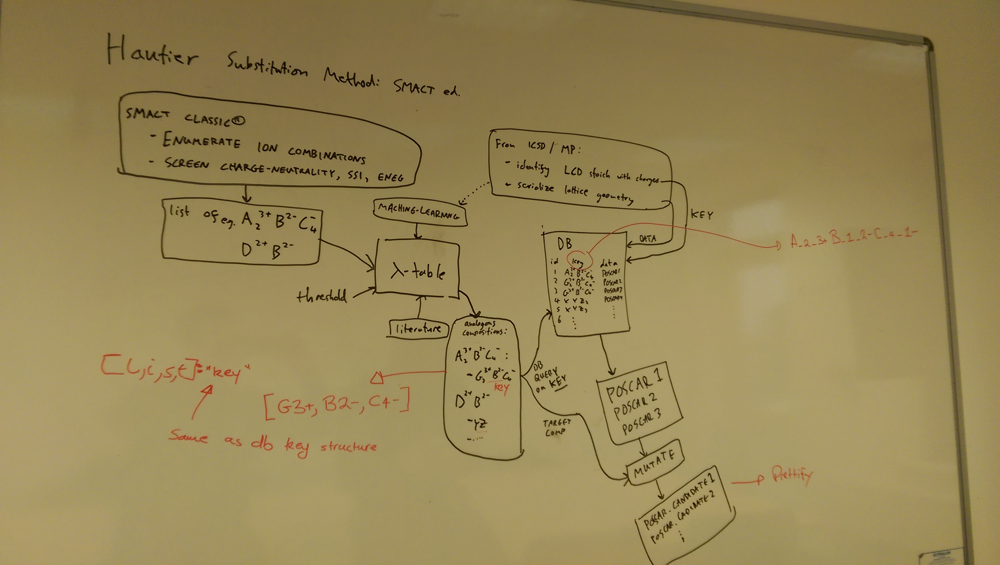
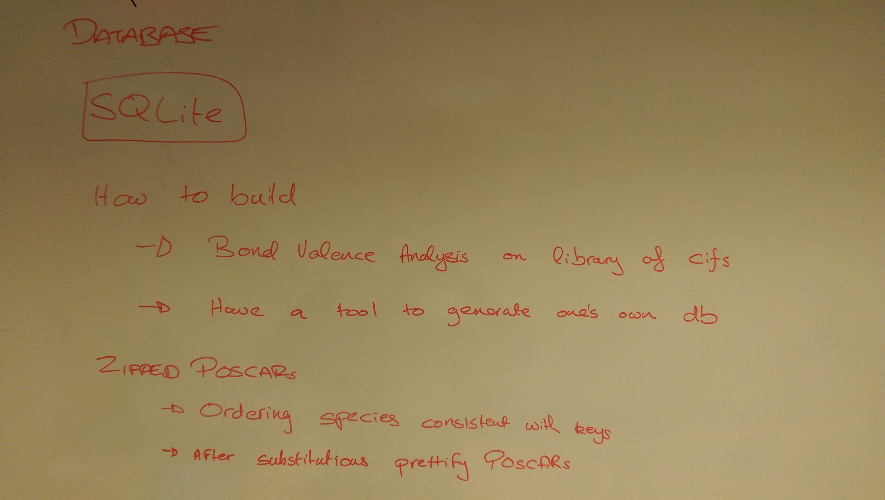

# Structure Predictor Design Doc
---

## Motivation
The `PYMATGEN` structure predictor [based on [this paper](https://pubs.acs.org/doi/10.1021/ic102031h)] is a useful tool for going from chemical composition to a reasonable crystal structure, based on a similarity index of ions. 
This tool works particularly well with the `SMACT` methods for generating reasonable compositions. However, there are two major reasons for building our own structure predictor: (i) relying on `PYMATGEN` as a dependancy is less than ideal; (ii) the `PYMATGEN` method is not as fast as it could be, in terms of interfacing with `SMACT`. Therefore we propose implement a similar method in `SMACT`.

## Required features

* A composition with structure object (code object)
	* Minimal and zippable
	* Lattice vectors
	* Ion (name and charge) types and numbers
	* Coordinates
	* It was decided to adopt `POSCAR` style (`VASP5`)
* A database of known materials (database)
	* Structures stored in above format
	* Each has a unique key
	* Each has an id
	* `SQLlite`
* $\lambda$ table (data file)
	* Contains substitutions probabilities
	* Initially take `PYMATGEN` table
* Probability method (code method)
	* This calculates the probability of any possible substitution - those above the threshold are passed on.
* An object to store possible substitutions (code object)
	* A list of lists
* A mutation method (code method)
	* This will replace ions in the known structure with those of the target structure
* A prettify method (code method)
	* This will fix species order in the outputs to follow conventions

## Proposed Workflow

* Generate a list of target compositions eg for Ba$_2$OF$_2$ `[Ba2+, O2-, F1-, (2, 1, 2)]`
* Make all possible substitutions in the $\lambda-$table (no need to worry about stoichiometry)
* Check the probability of the result
* IF it passes - create the key of the passed result, so if Ca, S, Cl substituting the above formula passed, the key is `Ca_2_2+S_1_2-Cl_2_1-`
* Check if that key exists in the database
* If the key exists add it to our `Substitution list`
* For each key in the substitution list perform a mutation on the structure object that turns it into the target compound
* Prettify the resulting structure object

## Suggested development plan 

* A method to convert a composition to a unique key
* A method to generate our structure objects from MP entries
* A database of all MP structures - in our structure format and with keys in our key format 
* A method to perform all possible substitutions between the target composition and the elements in the $\lambda$-table
* A method to evaluate the probability of the result
* A method to mutate the structure object - by replacing species with those in the target compound
* A method to prettify the resulting compound structure so that it follows convention	

### Description of elements

These are some more fleshed out prototypes of objects/methods that are described above. They are open to discussion.

#### Composition/structure object

	Ca2+ O2- F1-
	1.0
	VECA
	VECB
	VECC
	Ca O F
	2  1  2
	Coordinates
	.
	.
	.
	END
	
* Ordering consistent with Database key (see below)

#### Database

* Entries to be created by a valence bond analysis of structures

* Simple two field database
	* Field 1: database key
	* Field 2: location of zipped structure object file

#### Database Key

* Information about element, charge and stoichiometry.
* The elements must be ordered by alphabet.
* The species ordered by charge highest to lowest.

E.g. 
* Ba$_2$OF$_2$ -> `Ba_2_2+F_2_1-O_1_2-`
* Fe$_3$O$_4$ -> `Fe_1_2+Fe_2_3+O_3_2-`

#### Substitution list

[[[targetA],["subs1A","subs2A",...]],[[targetB],["subs1B"],...] 

* target is a list, the target composition - this is generated rather than stored. After each generation 
* subs are keys, for the potential compositions to substitute into

	Example of [[targetX],[subsNX],...] structure
	[[[Ba2+, O2-, F1-], ["Ca_2_2+O_1_2-F_2_1-", "Mg_2_2+O_1_2-F_2_1-"]]...]
	

   
		           
