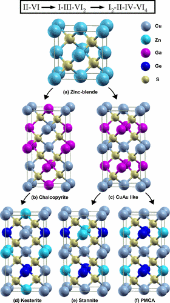

# SMACT Examples
A collection of computational experiments using the open-source package [SMACT](https://github.com/WMD-group/smact).

## Requirements

### Python
An introduction to the importance of Python for scientists, and the basics of the coding language, is available [elsewhere](https://www.researchgate.net/profile/Brian_Toby/publication/269995603_Whypython_scientists_should_learn_to_program_in_Python/links/549dbd610cf2b803713a7bec.pdf). For a complete beginner, [Codecademy](https://www.codecademy.com/learn/learn-python-3) or [Datacamp](https://www.datacamp.com/courses/intro-to-python-for-data-science) are good places to start. These examples have been tested with **Python 3.6**.

### Packages
The examples are presented in [Jupyter notebooks](http://jupyter.org). Jupyter is included with standard Python distributions such as [Anaconda](https://www.continuum.io/downloads) and the [Homebrew Superpack for Mac](http://stronginference.com/ScipySuperpack/). There are dependencies on [SMACT](https://github.com/WMD-group/smact) and for some practicals [ASE](https://wiki.fysik.dtu.dk/ase/) and [Pymatgen](www.pymatgen.org).

## Example notebooks

### Practical tutorial
A two-part tutorial that has been used as a teaching aid for masters courses in the UK (University of Bath) and Korea (Yonsei University). It is probably the most pedagogical example and is a good place to start. It consists of two parts:

- **Combinations_practical.ipynb:** The "bread and butter" of SMACT. This covers the basics of constructing the search space for new inorganic materials by considering raw combinations of elements. The resulting space is then filtered using rules based on simple chemical ideas such as electronegativity and charge neutrality.
- **ELS_practical.ipynb:** Covers an example procedure for matching the surfaces of two inorganic materials together, as described in [this publication](https://pubs.rsc.org/en/content/articlelanding/2016/tc/c5tc04091d#!divAbstract) by Butler et. al.

### Counting
These examples also explore the generation of compositional spaces:

- **Generate\_compositions\_lists.ipynb:** A walkthrough of how to use SMACT to generate a list
of allowed compositions from a chosen search-space of elements. It shows how to choose the elements
you are interested in, and how to apply the standard smact_filter with a certain stoichiometry threshold (see [docs here](https://smact.readthedocs.io/en/latest/examples.html#neutral-combinations) for more info).
It also shows you how to interface the output to [Pymatgen](http://pymatgen.org/) or [Pandas](https://pandas.pydata.org/).

- **Raw_combinations.ipynb:** Does not use SMACT, but uses itertools to calculate the raw number of possible
element or species combinations for 2, 3 and 4-component compositions.

- **ElementCombinationsParallel.py:** A script that reproduces the numbers in Table 1 of the 2016 Chem Paper
[Computational Screening of All Stoichiometric Inorganic Materials](https://www.cell.com/chem/fulltext/S2451-9294(16)30155-3).
It is currently only Python2 compatible and is kept here as a record of the calculation methodology.

### Cation mutation

The concept of cation mutation (ion substitution) to tune the properties of compounds has been around at least [since the 1950s](https://www.sciencedirect.com/science/article/pii/0022369758900507) and has proved a useful concept in [more recent studies](https://journals.aps.org/prb/abstract/10.1103/PhysRevB.79.165211).

This example generates all possible (symmetry inequivalent) substitutions of Sr on Ba sites in the cubic perovskite
BaTiO3; single and double substitutions.
The distorter module uses the [ASE Python library](https://wiki.fysik.dtu.dk/ase/) to achieve this.

### Inverse perovskites

 Perovskites are an important class of inorganic materials, particularly for solar energy applications.
 Usually, the perovskite structure contains an A cationm, a B cation and an X anion in the ratio 1:1:3 ([see wikipeidia for more information](https://en.wikipedia.org/wiki/Perovskite_(structure))).
 Here we search for charge inverted perovskites, i.e. with an anion on the A site. This class of material is closely related to perovskites, and may represent another fruitful search space for new photovoltaic materials.

In this example  we assume a simple [formate molecule](https://en.wikipedia.org/wiki/Formate) as the C-site and uses [Goldschmidt ratio rules](https://en.wikipedia.org/wiki/Goldschmidt_tolerance_factor) as part of the screening.
These rules allow us to estimate whether or not a perovskite structure is likely to form based on data about ionic size alone.
We also apply the standard charge neutrality and electronegativity tests as described [in the docs](https://smact.readthedocs.io/en/latest/examples.html#neutral-combinations).

### Solar oxides
Generates a set of quaternary oxide compositions using a modified `smact_filter` function and then turns the results into a dataframe with features that can be read by a machine learning algorithm.

### Simple wrappers

Gives a simple example of how SMACT can be incorporated into a python script
for use at the command line using argparse.

### Structure prediction
Contains an example workflow of using the structure prediction submodule which is based on ionic substitution of SMACT. The inspiration for this submodule was from a [2011 paper by Hautier et al.](https://pubs.acs.org/doi/abs/10.1021/ic102031h).
The notebooks involve setting up a database of SMACT compatible structures, generating the compositions, and using the structure prediction tool to assign compositions to a known crystal structure system.

### Dopant prediction
Contains an example of using the dopant prediction submodule.

### Oxidation states
Contains an example of using the `smact.oxidation_states` submodule to predict the likelihood of metal cations coexisting with halide anions in ternary compounds based on a statistical analysis of oxidation states. Full details of the oxidation states model can be found in [this publication](https://pubs.rsc.org/en/content/articlelanding/2018/FD/C8FD00032H).